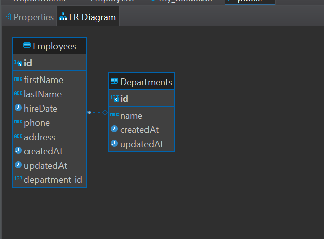

# fullstack-assessment

This project is a built with React.js for the frontend and Node.js (with TypeScript) for the backend, using PostgreSQL as the database.

### Backend (Node.js + TypeScript)

The backend API handles data management for employees and departments, with routes for CRUD operations, soft-deletion, and department change history. Key parts include:

- **Database**: PostgreSQL, with Sequelize as the ORM.
- **Server**: Express.js for routing.
- **Soft Deletion**: Implemented for employees, using `deletedAt` column.
- **Department Change History**: Tracks department changes for each employee.

#### ER Diagram from the First Task


### Frontend (React + Redux)

The frontend is a React app managing the global state with Redux.

- **Components**:
  - **Employee List Page**: Displays all employees with basic details, department, and buttons for "View Details," "New Employee," and "Delete".
  - **Employee Details Page**: Shows detailed employee information, department change history, and functionality for updating department or deactivating the employee.
  - **Employee Creation Page**: Shows a simple pop up form to create a new employee.
- **Redux Store**: Manages employee and department data across the application.

## How to run

### Prerequisites

Make sure you have the following installed:
- **Node.js** (>= 14.x)
- **PostgreSQL** (>= 12.x)

### Environment Variables

Create a `.env` file in the root of the backend directory with the following variables:

```
DATABASE_URL=postgres://<username>:<password>@localhost:5432/<database_name>
DB_USERNAME=your_username
DB_PASSWORD=your_password
DB_NAME=my_database
DB_HOST=localhost
DB_PORT=5432
PORT=80
```

Create a `.env` file in the root of the frontend directory with the following variables:

```
REACT_APP_API_BASE_URL=http://localhost:80
```
> You will find examples of the `.env` files on each project

### Backend Setup
1. Install Dependencies:

```bash
cd backend
npm i
```

2. Run the server:

```bash
npm run dev
```
> The backend uses `npx tsx` [(this library)](https://github.com/privatenumber/tsx) to run TypeScript files without needing a separate compilation step.

The backend will run on http://localhost:80

### Frontend Setup
1. Install Dependencies:

```bash
cd frontend
npm install
```

2. Run the frontend:

```bash
npm start
```

The frontend will run on http://localhost:3000

## Contact

For any questions or inquiries, please feel free to contact:

- **Name**: Gonzalo Rochlin
- **Email**: gonzarochlin@gmail.com
- **LinkedIn**: [Gonzalo Rochlin](https://www.linkedin.com/in/gonzalo-rochlin/)

Thank you!